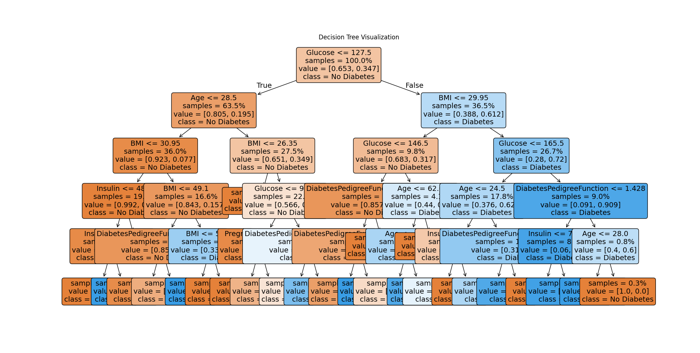
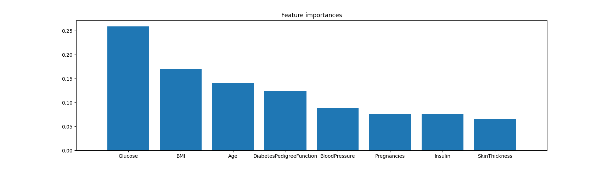

## Day-05

### KNN, Decision Trees, Random Forest

Tried using `K-Nearest-Neighbours`, `Decision Tree`, `Random Forest` model, and `Cross Validation Score` for a Random Tree, all on the same dataset of Diabetic Patients.

Also did some basic data visualization on `Matplotlib`,

It looks way too clustered, couldn't figure out what to do of it.

