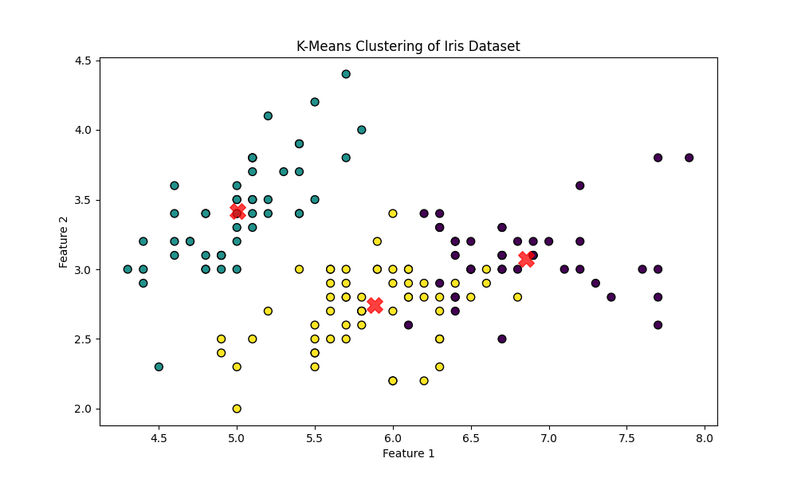
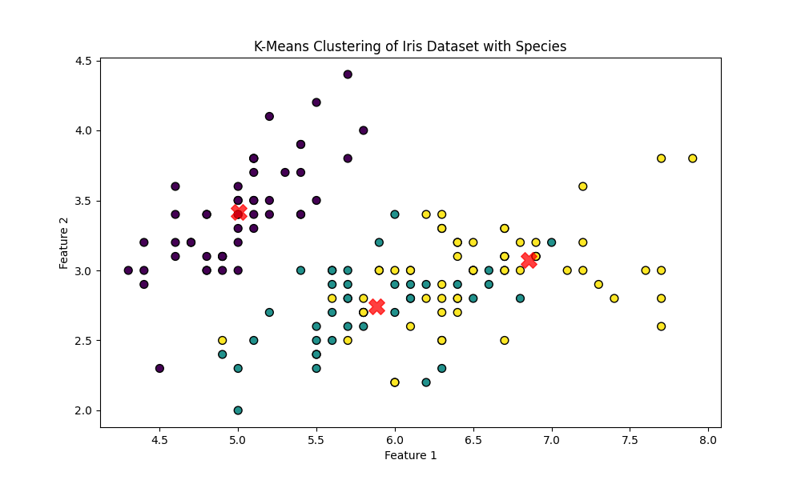
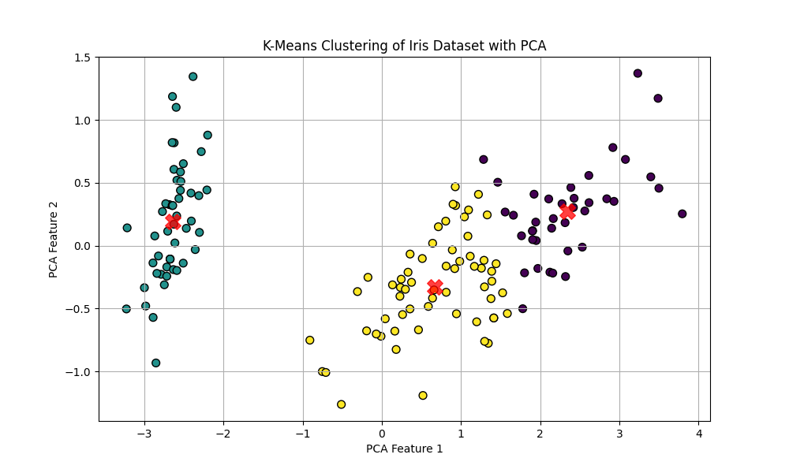

## Day-06

### K-Means Clustering

Worked on Unsupervised Learning by using the `K-Means Clustering` algorithm to cluster the `iris dataset`.

It worked, but it was labelling the clusters with different labels than the actual labels, considering it is unsupervised learning, it is not a problem, but the program was showing the output as `14 / 150 are correct`, but after manually changing the labels it gave `133 / 150 are correct`.

Also tried to use Principal Component Analysis (PCA) before Clustering the data to get better results, ... it gave the exact same result.

Result of K Means Clustering.

Result of Clustering based on Labels.

We can see the shape of clusters is almost the same, but the colors are change. It is mis-labelling, but no problem considering unsupervised learning.

Plotting Clusters after Principal Component Analysis