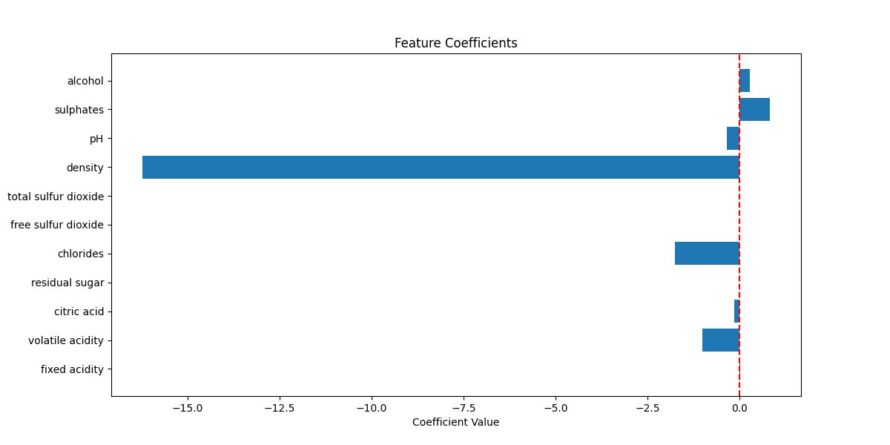
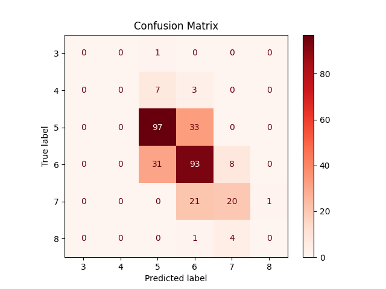
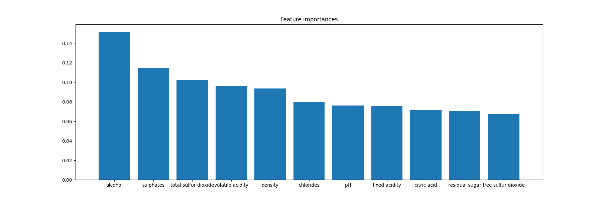

## Day-08 - Mini-Project

Today I choose to work on a small project to reflect on my Machine Learning practice.

Picked up `Wine Quality` dataset from Kaggle, this dataset has 11 features that determine the Quality of the Wine on range from 0 to 9 (although it only has values from 3 to 8).

I choose to try this using both a Regression model and a Classification model.

### Regression
Implemented a `Linear Regression` model to estimate the Quality of the Wine based on the 11 features, and plotted the Feature Coefficients on `MatplotLib` to visualize which factor contributes how much to the quality.

### Classification
Used a `Random Forest Classifier` to classify the Wine Quality into the label of the quality. Got almost `65%` accuracy, which is not great, but good enough considering it is a regression problem forced into a classification problem.

Also plotted the `Confusion Matrix` and `Feature Importances`.

### A Question that's unanswered

Although this Mini-Project was a good reflection on my Machine-Learning Practice of few days, it also gave a question that is left unanswered.

When comparing `Feature Coefficients` from `Linear Regression` with `Feature Importances` from `Random Forest Classifier` model, we can that `Linear Regression` gives the largest co-efficient to `Density` (largest when taken absolute value, as it's co-efficient is negative), but `Random Forest` gives highest Feature Importance to `Alcohol` (not `Density`).

GPT explained this saying that `Linear Regression` is sensitive to `multicolinearity` (high co-relation between multiple features), and in our case `Density` and `Alcohol` are highly co-related, more `Alcohol` means less `Density`. Which is possibly why `multicolinearity` may be inflating the co-efficient of `Density`, a common issue in Linear Models.

I'll be fair, I somewhat understand GPT's explaination and somewhat don't.