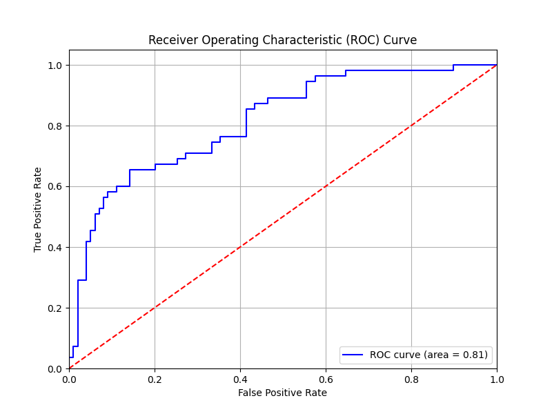
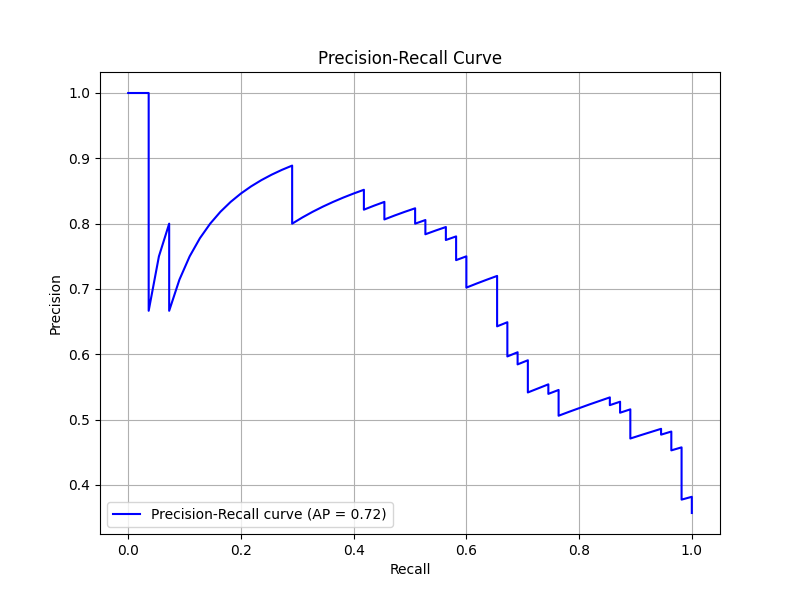

## Day-10

### Model Evaluation Metrics

Spent some time learning about the theory of Model Evaluation Metrics, like `Confusion Matrix`, `Precision`, `Recall`, `F1-Score`, and `Reciever Operating Characterstics - Area Under the Curve (ROC-AUC)` for classification and `Mean Squared Error (MSE)`, `Mean Absolute Error (MAE)`, `Root Mean Squared Error (RMSE)`, and `Coefficient of Determination (R^2)` for regression.

For practice, I tried plotting `ROC Curve` and `Precision-Recall Curve` of a basic `Logistic Regression Model`.

**ROC Curve**

**Precision Recall Curve**
