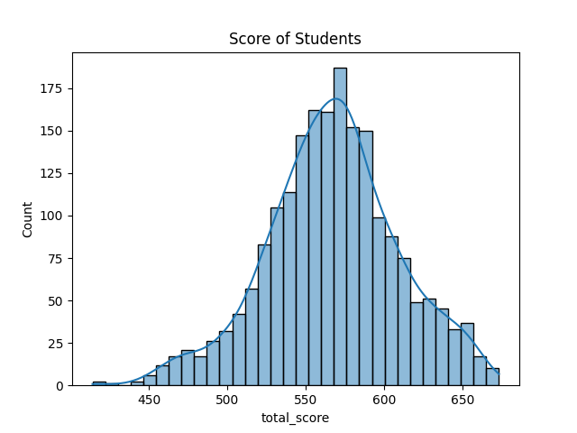
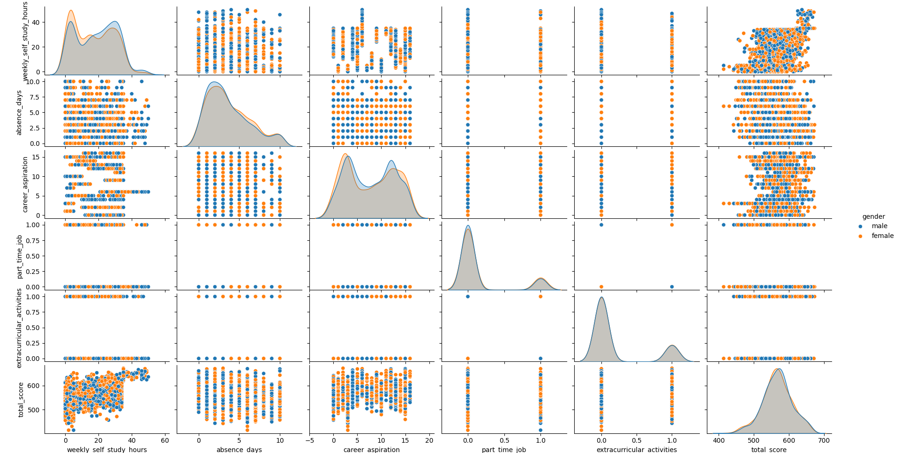
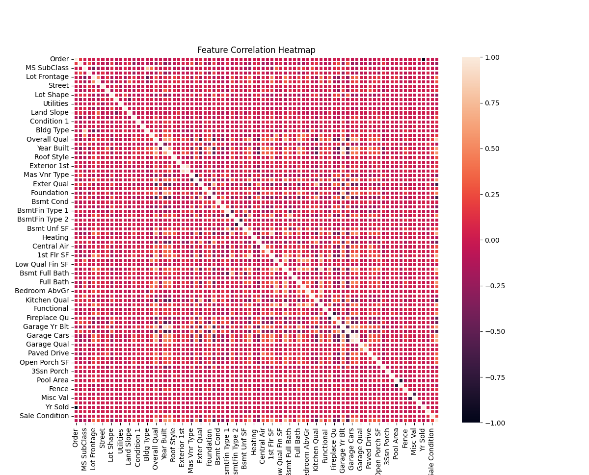

## Day 12 & 13

### Exploratory Data Analysis (EDA)

Haven't done that much in these 2 days, just a little bit of EDA like a `Heatmap`, `Pairplot`, and a `Histplot` on 2 datasets.

Plotted a `Histplot` on the *Student Score Dataset*, 

Plotted a `Pairplot` on the same *Student Score Dataset*, some horizontal and vertical lines can be seen, they are `bool` values encoded using the `LabelEncoder`.

Also plotted a `Heatmap` for the Feature Correlation on the *AmesHousing Dataset*, as the dataset has 82 columns, its heatmap is way too complex.

To be fair, I don't really enjoy doing EDA.