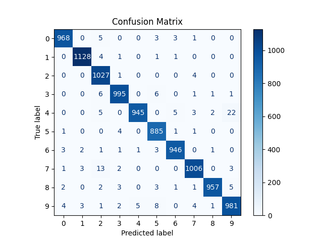

## Day 15

### Convolutional Neural Networks

Learned about `Convolutional Neural Network`, and implemented a `CNN` to recognize the `MNIST Digits`.

It contains `Convolution Layers`, `Max Pooling Layers`, `Batch Normalization`, 2 `Fully Connected Layers`, and a `Dropout` Layer.

It is trained for only `1 Epoch` and gets an accuracy of `98 %`.

